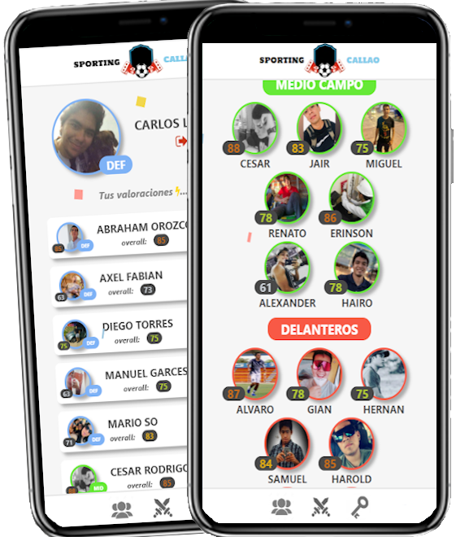

# Sporting Callao App
This is my very first project I had in mine once I learned MEVN Stack.
This allows to see the ranking made by ourselves (players - my friends).
Design was inspired by Duolingo App.

## Techs used.

### Backend
- Nodejs (Express)
- Mongodb (Atlas)
- Heroku
- JSON Web Token
- Other NPM modules

### Frontend
- Vue
- Vuex
- SCSS (SMACCS)

## Screenshots
